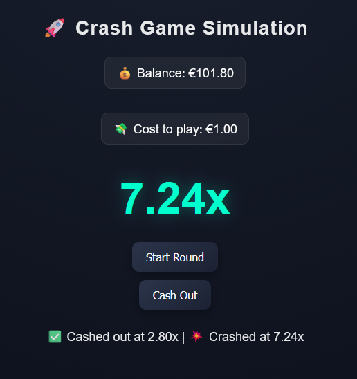

# 🚀 Crash Game Simulation

A real-time crash-style game built in JavaScript, featuring custom probability distributions, smooth animation curves, and multiplayer-style round behavior.

This project explores the design and balancing of “crash” mechanics — where a multiplier increases over time until it randomly crashes, and players must cash out before losing their bet.

---

## 🎮 Features

* 📈 **Smooth multiplier growth**

  * Custom animation using `requestAnimationFrame`
  * Non-linear growth curve for better game feel

* 🎲 **Custom crash distribution**

  * Log-based probability curve (`-ln(1 - r)`)
  * Tunable difficulty via scaling factor `K`
  * Optional rare “instant crash” events

* 💰 **Betting & balance system**

  * Fixed buy-in per round
  * Real-time balance updates
  * Winnings based on multiplier at cashout

* 👥 **Multiplayer-style round logic**

  * Rounds continue after player cashout
  * Player state separated from game state
  * Displays both cashout result and final crash point

* ⚡ **Responsive input**

  * Immediate cashout handling
  * Frame-synced animation loop

---

## 🧠 How It Works

### Crash Generation

Each round generates a crash point using a probability distribution:

```js
let r = Math.random();
let raw = -Math.log(1 - r);
let crashPoint = 1 + raw * K;
```

Where:

* `r` is a random number in (0, 1)
* `K` controls how aggressive the curve is

This produces a smooth, heavy-tailed distribution:

* Most rounds end early (low multipliers)
* Some rounds run longer (high multipliers)
* Extreme spikes are controlled and tunable

---

### Multiplier Growth

The multiplier increases over time using a non-linear curve:

```js
let t = Math.pow(seconds * speed, 1.6);
multiplier = 1 + t + Math.pow(t, 2.2) * 1.5;
```

This creates:

* Slow, readable early growth
* Increasing tension over time
* Faster scaling at higher multipliers

---

### Game Flow

1. Player starts a round (bet is deducted)
2. Multiplier begins increasing
3. Player can cash out at any time
4. Round continues until crash point
5. Outcome is displayed:

   * ✅ Cashout multiplier
   * 💥 Final crash multiplier

---

## ⚙️ Configuration

You can tweak game behavior using these variables:

```js
let speed = 0.05; // animation speed
let K = 3;        // crash curve scaling
```

### Suggested values:

| K value | Behavior                   |
| ------- | -------------------------- |
| 3       | safer, longer rounds       |
| 5       | balanced                   |
| 7       | aggressive, faster crashes |

---

## 📊 Design Goals

This project focuses on:

* Creating a **smooth and fair-feeling crash curve**
* Avoiding exploitable strategies
* Balancing **risk vs reward**
* Improving **game feel through animation and timing**

---

## 🚧 Future Improvements

* 🎧 Sound effects and feedback
* 📈 Multiplier graph visualization
* 👤 Simulated multiplayer players?
* 🧾 Round history log
* 🎯 Adjustable bet sizes
* 🌐 Backend for real multiplayer?

---

## 🛠 Tech Stack

* JavaScript (Vanilla)
* HTML / CSS
* `requestAnimationFrame` for animation

---

## 📌 Notes

This is a simulation project intended for learning and experimentation with probability, game loops, and real-time UI — not a production gambling system.

---

## 📷 Preview

### Gameplay Example


---

## 📄 License

MIT

---
